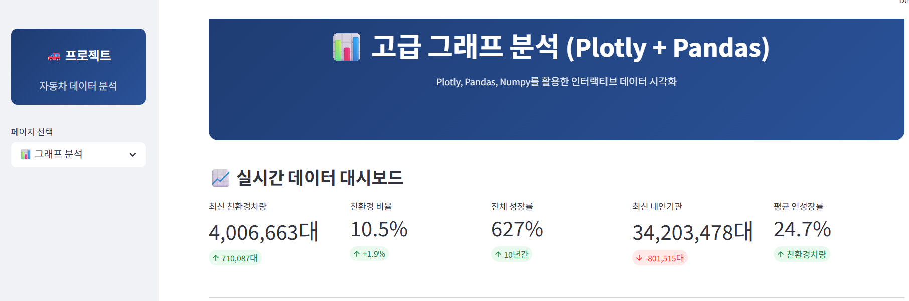
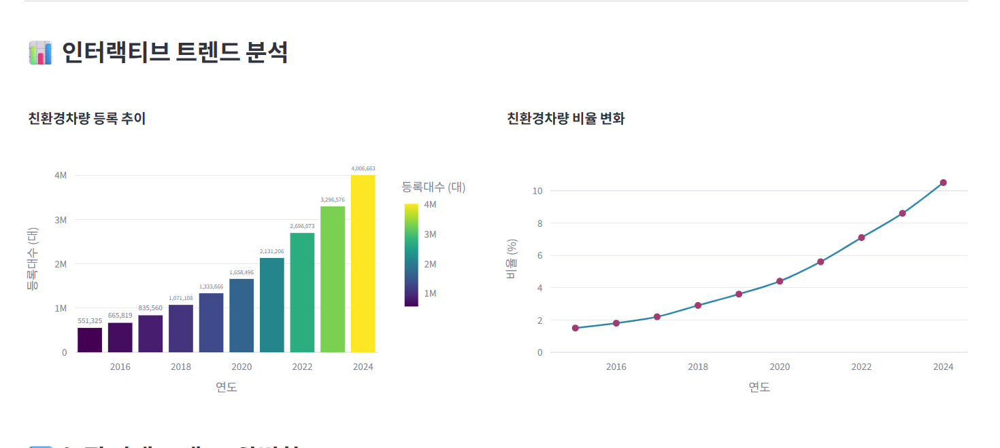
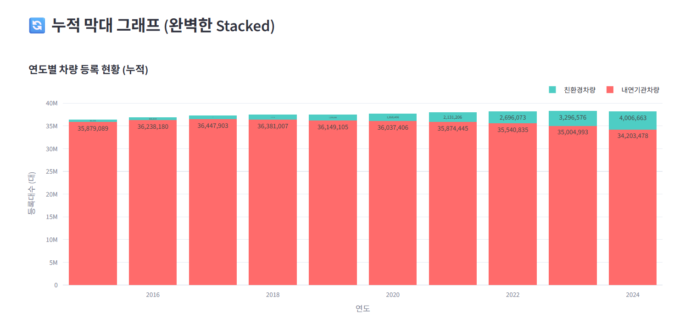
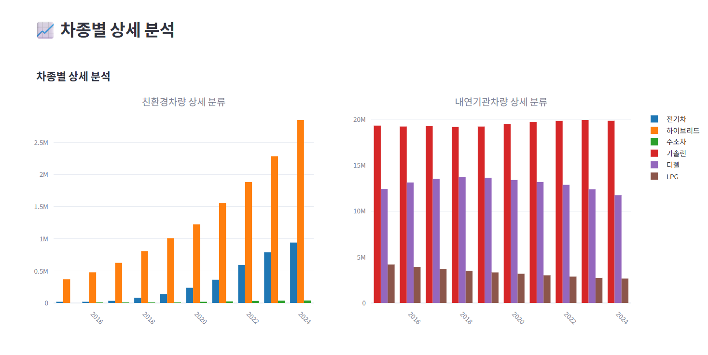
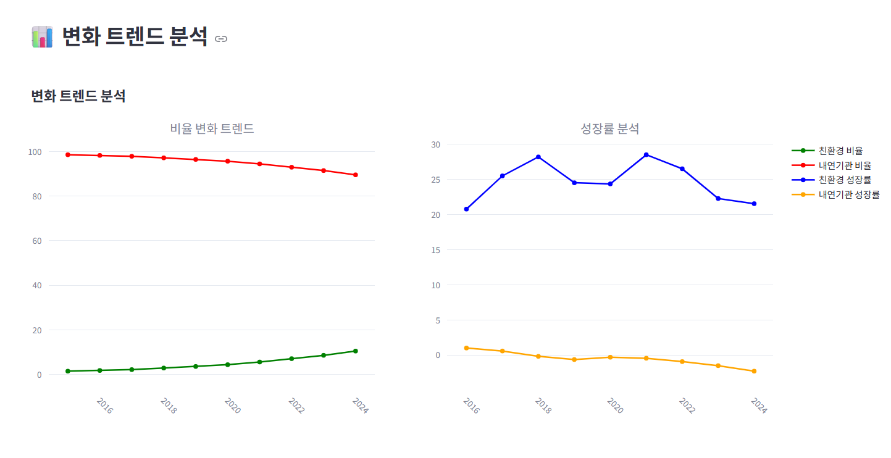
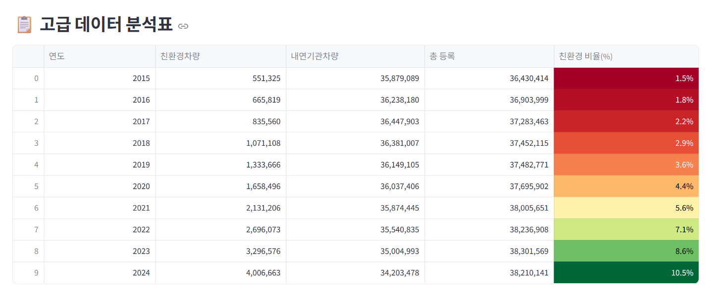
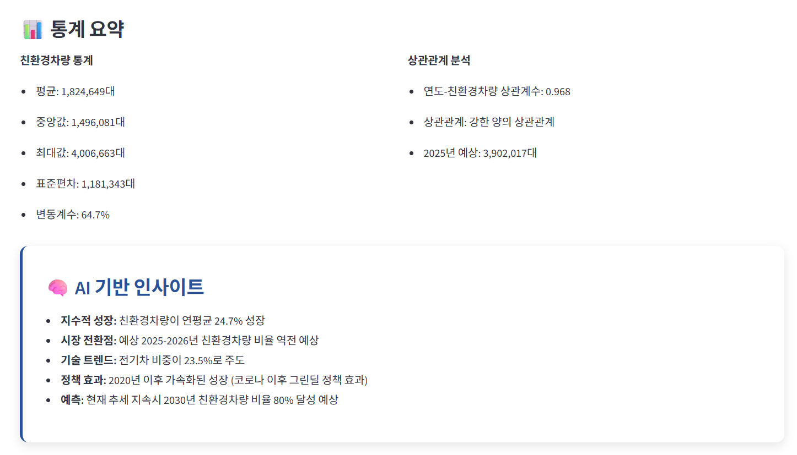

# SKN20-1ST-5TEAM-

## 🍀 팀원소개
| 😀 박찬 | 🙂 정래원 | 😎 조준상 | 🤗 문창교 | 🤔 이경현 |
|--------|----------|----------|----------|----------|

## 🖥️ 프로젝트
### 📅 개발 기간
- **2025.09.24 ~ 2025.09.26 (총 3일)**

### 🚗 프로젝트 주제
- 친환경차량과 비친환경 차량의 10년간 변화추이신규 등록 추이
 
## 📌 프로젝트 개요
### 📝 프로젝트 소개
- 본 프로젝트는 최근 10년간의 자동차 등록 데이터를 기반으로, 내연기관차에서 친환경차(전기, 하이브리드 등)로의 전환 추이를 분석하고 시각화한 것입니다

### 🔍 프로젝트 필요성
- 정부 정책, 환경 규제, 시장 변화에 따라 친환경차의 수요가 급증하고 있어, 이를 데이터로 확인함으로써 미래 시장 예측과 투자 판단에 도움을 줄 수 있습니다."

### 🎯 프로젝트 목표
- 파이썬 기반 크롤링을 통해 데이터를 수집하고, MySQL DB를 설계·구축하여 저장하였습니다. 이후 파이썬과 MySQL을 연동하여 Streamlit으로 시각화를 구현하는 것을 목표로 하였습니다."

## 🛠️ 기술 스택
 

## 📋 프로젝트 구조
### 📈 WBS (Work Breakdown Structure)
1 주제 선정 및 목표 정의
2 분석 범위 설정 (10년간 변화, 신규 등록 추이)
3 일정 및 역할 분담
4 데이터 수집 (크롤링)
5 데이터베이스 설계 및 구축
6 문서화 및 발표 준비

## 📊 ERD 구조

## 📋 테이블 명세서

## 📚 데이터 소개
### 🚗 수집 데이터 출처
 **🏛️국토교통통계누리**: 전국 연료별 자동차 등록 현황
 **🏙️Eseoul**: 연료별 자동차 등록 현황 
 **🚘현대자동차홈페이지**: FAQ 데이터

### 🔧 데이터 수집 방법
🕸️ 웹 크롤링 동적 기법 적용
  
  
## 🗃️ 주요 기능
### 🔹 데이터 조회 기능
 📈 데이터분석
 🌱 친환경 트렌드
 🎯 인사이트 도출

### 🔹 데이터 시각화
📊 차트 및 그래프 제공을 통한 시각화
📈 실시간 대시보드를 통한 종합정보 한눈에 보기 가능
🤖 AI 기반 인사이트 제공

### 🔹 FAQ 시스템
❓ 현대자동차 및 제네시스 FAQ 조회 가능
🔎 키워드 검색 기능
💬 질문/답변 데이터 제공

## 🎬 프로젝트 결과 (Streamlit UI)
## 🔹 **메인화면**
- 
## 🔹 **대시보드 분석**
  
## 🔹 **그래프 분석**
  
  
  
  
  
## 🔹 **고급 데이터 분석**
  
## 🔹 **FAQ**
  
  

## 💭 한줄 회고
😀 박찬 : 팀원들과 첫 프로젝트를 진행하였는데, 다들 서로 배려해주시고 좋은 사람들과 같이 작업할 수 있어서 좋았습니다. 수업시간에 배운 부분들을 프로젝트에 잘 녹여낼 수 있어서 좋았고, 다들 고생하셨습니다.

🙂 정래원 : 크롤링을 처음 해보는 과정이라 많이 힘들었지만, 팀원들의 도움 덕분에 점점 이해할 수 있게 되었습니다.
특히 이번 프로젝트를 진행하면서 Git을 자주 활용해 보았는데, 다소 어렵게 느껴졌지만 협업에 매우 유용한 도구라는 것을 깨달았습니다.
앞으로도 Git과 크롤링에 대해 더 깊이 배우고 싶습니다.

😎 조준상 : 
🤗 문창교 : 수업에서 배운 파이썬, DB, 크롤링을 전부 사용해 볼 수 있는 프로젝트여서 배운 내용들이 얼마나 체화되어 있는지 알 수 있는 기회가 된 것 같습니다. 머리로는 이해하고 적용할 수 있다고 생각했지만 실제 프로젝트에서는 생각보다 막히는 부분이 꽤 많아 당황스러웠습니다. 그래도 팀원들이 서로 모르거나 헷갈리는 부분을 알려주면서 차근차근 해결해 나간 것 같아서 뿌듯했습니다. 정말 고생 많으셨습니다. 감사합니다.

🤔 이경현 : 첫 프로젝트를 하면서 많은 한계를 느끼고 더 많은 공부가 필요하다는 걸 느꼈습니다. 그리고 많은 배려해 주신 팀원들에게 감사합니다.팀원들 도움으로 프로젝트를 마무리 할 수 있었습니다. 
 
